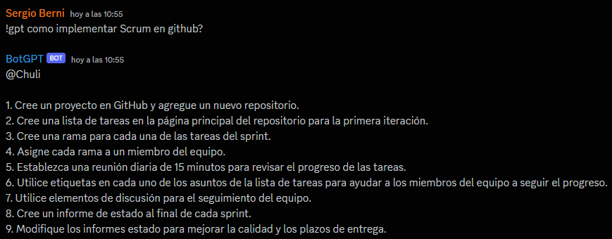

# BotGPT
_BotGPT es un bot para la aplicacion de texto Discord. Su funcion consiste en hacer consultas directamente a la API de OPENAI desde un canal privado de Discord o hablando directamente con el BOT._

## Comenzando 🚀

_Link de acceso al bot mediante el siguiente link: https://discord.com/api/oauth2/authorize?client_id=1091835082744004691&permissions=1634235578432&scope=bot_
__

### Comando para el uso ⚙️

_El uso del bot se realiza con el comando *!gpt* seguido de un prompt_

```
!gpt Como implemento Scrum en Git-Hub?
```



## Construido con 🛠️

_A continuacion las herramientas utilizadas para la elaboracion_

* [Discord Developer Portal](https://discord.com/developers/docs/intro) - Usado para la creacion del BOT
* [Openai API](https://github.com/openai) - Manejador de dependencias
* [Discord.py](https://discordpy.readthedocs.io/en/stable/) - Usado para generar RSS

